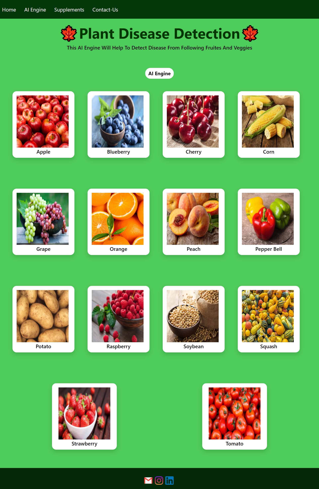
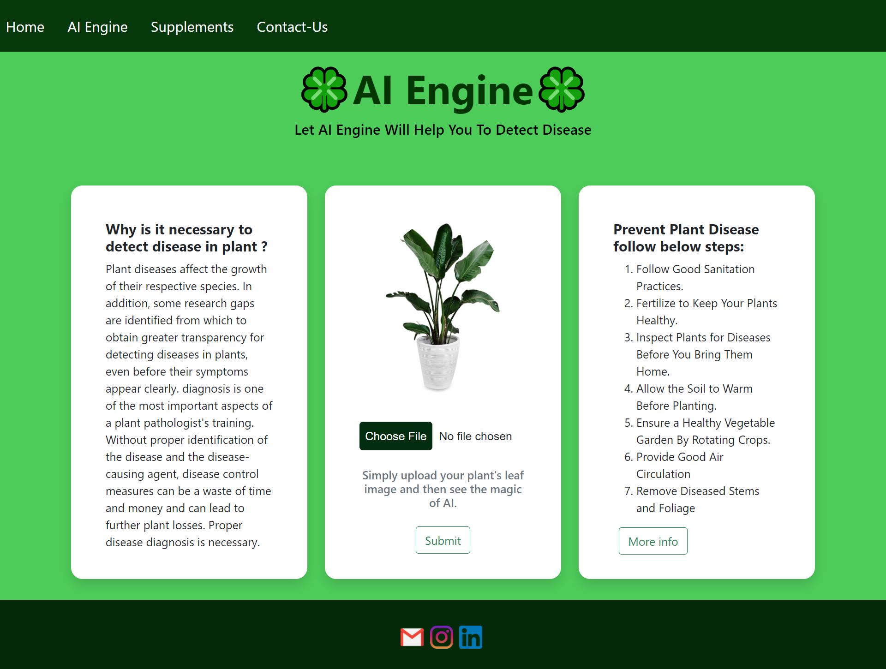
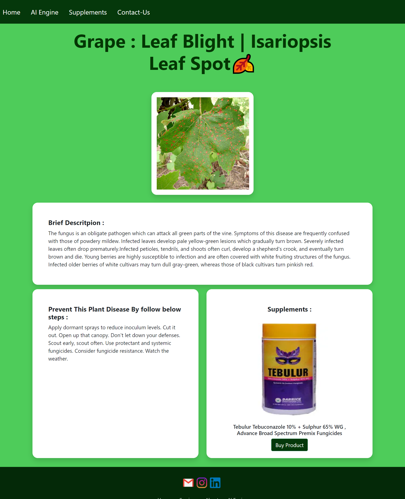

# ⭐ Plant Disease Detection

Plant disease detection is crucial for farmers to maintain healthy crops. This project utilizes deep learning, specifically a Convolutional Neural Network (CNN), to classify leaf images into 39 different disease categories. The model is built using PyTorch and trained on the PlantVillage dataset.

## ⭐ Features
- Deep Learning-based disease classification
- Flask web app for easy accessibility
- Pre-trained model for instant use
- Open-source contributions are welcome!

## ⭐ Tech Stack
- Python 3.8
- PyTorch
- Flask
- Jupyter Notebook
- HTML, CSS, JavaScript

## ⭐ Installation and Setup

1. Clone the repository:
   ```sh
   git clone https://github.com/your-username/LeafSense.git
   cd LeafSense
   ```
2. Create a virtual environment and activate it:
   ```sh
   python -m venv venv
   source venv/bin/activate  # On macOS/Linux
   venv\Scripts\activate     # On Windows
   ```
3. Install dependencies:
   ```sh
   pip install -r requirements.txt
   ```
4. Download the pre-trained model `plant_disease_model_1.pt` from [Google Drive](https://drive.google.com/drive/folders/1ewJWAiduGuld_9oGSrTuLumg9y62qS6A?usp=share_link) and place it inside the `Flask Deployed App` folder.
5. Run the Flask app:
   ```sh
   python app.py
   ```
6. Open `http://127.0.0.1:5000/` in your browser to access the app.

## ⭐ Contribution Guidelines

- Fork the repository and clone it locally.
- Create a new branch for your changes.
- Ensure your code is well-documented and error-free.
- Submit a pull request with a clear description of the changes.

## ⭐ Testing Images
- Sample test images are provided in the `test_images` folder.
- Each test image has its corresponding disease name for verification.

## ⭐ Blog Link
- [Plant Disease Detection Using CNN with PyTorch](https://medium.com/analytics-vidhya/plant-disease-detection-using-convolutional-neural-networks-and-pytorch-87c00c54c88f)

## ⭐ Web App Deployment
- The web app is deployed at [Plant Disease Detection AI](https://plant-disease-detection-ai.herokuapp.com/)

## ⭐ Web App Screenshots

#### Home Page


#### AI Engine


#### Results Page


#### Supplements/Fertilizer Store


---

Feel free to contribute and improve this project!

